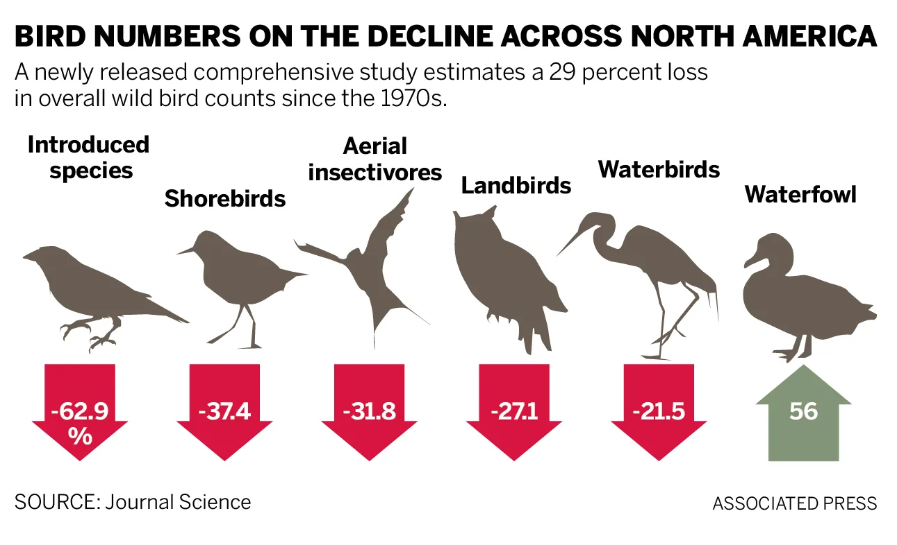

# What do Bird Populations Reveal?

Biodiversity plays a fundamental role in maintaining ecosystem stability and function. Ecosystems composed of diverse species tend to be more productive and resilient because species perform complementary ecological roles [@Cardinale2012]. This diversity allows ecosystems to continue functioning even when environmental conditions change, acting as a form of ecological insurance against disturbance.

Healthy ecosystems provide services that directly support human societies. Pollination, pest control, nutrient cycling, carbon storage, and water purification are all ecosystem services sustained by biological diversity. The productivity and reliability of these services depend heavily on the presence of stable and abundant species populations [@Cardinale2012]. When biodiversity declines, ecosystems may lose the capacity to provide these benefits consistently, limiting future food security, economic stability, and environmental resilience.

Birds offer one of the clearest indicators of ecosystem change because they occupy diverse ecological roles and are widely monitored across regions and time [@Lees2022]. They disperse seeds, regulate insect populations, recycle nutrients, and contribute to ecosystem balance in both natural and agricultural systems [@Dupont2025]. Yet recent research reveals the scale of their decline. A landmark continental analysis found that North America has lost nearly 3 billion birds since 1970, representing a net decline of approximately 29 percent of the total breeding bird population [@Rosenberg2019].

Importantly, these losses are driven largely by declines in once-common species rather than rare ones [@Dupont2025]. This finding signals widespread ecosystem change rather than isolated conservation failures. Habitat conversion and degradation remain central causes, reducing the ability of landscapes to sustain bird populations even where habitat technically remains.

Grassland birds have experienced some of the steepest declines of any group, as native prairies and sagebrush ecosystems give way to agricultural expansion. However, conservation initiatives demonstrate that recovery is possible. Collaborative restoration efforts in the Northern Great Plains have already improved more than 400,000 acres of habitat through partnerships with private landowners and conservation agencies [@AmericanBirdsConservancy]. Similarly, forest restoration programs in Pennsylvania have increased habitat diversity across hundreds of thousands of acres, producing measurable improvements in bird communities [@AmericanBirdsConservancy].

Research suggests that relatively small changes in land management can significantly increase plant and insect diversity while providing nesting and foraging habitat for birds [@AmericanBirdsConservancy]. These practices can enhance soil retention, reduce runoff, and support pollinators, often with minimal impact on agricultural productivity. Such findings illustrate that biodiversity conservation and human land use need not be opposing goals.

Bird populations therefore provide a powerful lens through which to evaluate progress toward Sustainable Development Goal 15. Changes in bird diversity reflect broader transformations occurring across ecosystems and offer measurable indicators of environmental health. By examining patterns in bird biodiversity alongside land-use change and conservation efforts, it becomes possible to assess how global sustainability commitments translate into real ecological outcomes.
