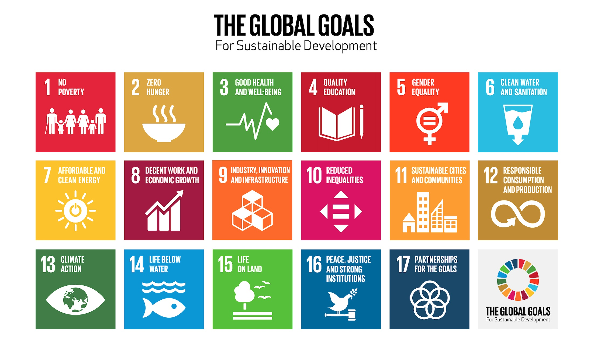

--- 
title: "The State of North American Birds: Biodiversity in a Changing Landscape"
author: "Jillian Hall"
date: "`r Sys.Date()`"
site: bookdown::bookdown_site
output: 
  bookdown::gitbook:
    config:
      sharing:
        facebook: false
        twitter: false
documentclass: book
bibliography: [bibliography.bib]
biblio-style: apalike
link-citations: yes
---

# Defining Biodiversity in a Global Context

In 2015, the United Nations adopted an ambitious framework designed to guide humanity toward a more sustainable future. Known as the Sustainable Development Goals (SDGs), this collection of seventeen interconnected objectives established a global indicator system intended to measure progress toward environmental protection, economic stability, and social well-being [@UnitedNationsGeneralAssembly2015]. The SDGs emerged in response to growing scientific consensus that human activity was reshaping Earth’s systems at an unprecedented rate, threatening ecological stability and long-term human prosperity.

Among these goals, Sustainable Development Goal 15 focuses specifically on life on land. SDG 15 aims to protect, restore, and promote the sustainable use of terrestrial ecosystems while combating desertification, halting land degradation, and preventing biodiversity loss [@UnitedNationsGeneralAssembly2015]. Biodiversity loss refers not only to the extinction of species but also to declines in species abundance and ecosystem complexity [@Hamilton2005]. Because biodiversity underpins ecological processes worldwide, its decline represents one of the most significant environmental challenges of the twenty-first century.

The SDGs were designed to provide measurable indicators of global progress. By tracking trends in habitat protection, species populations, and ecosystem health, SDG 15 offers a framework through which nations can evaluate whether conservation efforts are successfully slowing biodiversity loss. Yet despite the establishment of these global commitments, evidence increasingly suggests that biodiversity continues to decline across much of the planet [@Heydari2020].

